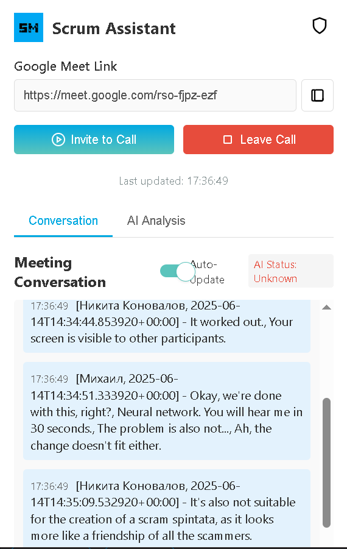
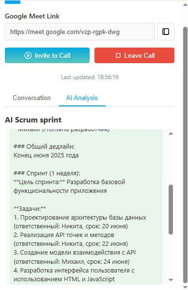

# A program for summarizing the text of meetings in google meet and formatting in scrum sprint



We have created the Santa Maria neuro-network assistant for creating Scrum sprints.

---
## 🚀 Features

- Connect to a call
- Recording a conversation
- Scrum print throughout the dialog

---
## Stack

- **Python** 3.10+
- javascript
- html
- css
- FastApi
- python-decouple
- pydantic
- typing
- aiohttp
- langchain_gigachat
- langchain_core

---
## 📦 Installation and Launch
1. Install the dependencies via the console:
   ```bash
   pip install -r requirements.txt
   ```
2. Open a browser and install the extension 
3. Log in to the google meet call and copy the link to the call
4. Insert it into the extension menu and click the invite call button
5. The bot will send the request in a call. Accept it
6. Next, the bot will create a dialogue, record and create a scrum sprint.
7. After completing the dialog, click the Leave call button.
8. The call is completed. Copy the Scrum sprint and you can send it to all the participants.